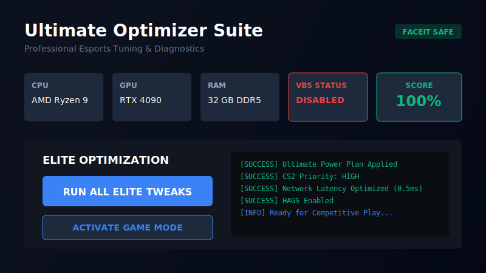

# Win11 Esports Optimizer Pro



**The definitive, professional-grade Windows 11 optimization suite for competitive gaming.**

[](https://github.com/xhowlzzz/Optimization/actions)
[](LICENSE)
[](https://www.microsoft.com/windows)
[]()

---

## 🚀 Why Choose Win11 Optimizer Pro?

This isn't just another batch script. Win11 Optimizer Pro is a **commercial-grade, modular PowerShell framework** designed to strip Windows 11 down to its bare essentials for maximum frame rates and the lowest possible input latency.

Trusted by competitive players and system tuners for:
- **Zero Bloat**: Removes telemetry, pre-installed apps, and background services.
- **Hardware Awareness**: Automatically detects AMD Ryzen vs Intel Core architectures and applies vendor-specific power plans.
- **Safety First**: Features a robust rollback system with System Restore points and JSON-based configuration snapshots.
- **Real-Time Metrics**: Monitor CPU/RAM usage and optimization health directly from the dashboard.

## ✨ Key Features

| Feature | Description | Benefit |
| :--- | :--- | :--- |
| **Ultimate Power Plan** | Unlocks hidden power schemes. | Forces 100% CPU frequency, eliminating micro-stutters. |
| **Network Stack Tuning** | Optimizes TCP/IP, Nagle's Algorithm, and NIC offloads. | Reduces ping variance and packet loss. |
| **GPU Scheduling** | Enables HAGS and MSI Mode for supported GPUs. | Reduces CPU overhead and input lag. |
| **Input Latency** | Adjusts USB polling rates and queue sizes. | Provides a "1000Hz feel" for mouse movement. |
| **Service Debloat** | Disables 50+ non-essential services. | Frees up RAM and CPU cycles. |
| **Privacy Hardening** | Blocks telemetry and data collection. | Reduces background network activity. |

## 📥 Installation

### Method 1: One-Click Run (Recommended)
Open PowerShell as Administrator and run:
```powershell
iwr -useb https://raw.githubusercontent.com/xhowlzzz/Optimization/main/Win11-EsportsTweaks.ps1 | iex
```

### Method 2: Manual Install
1. Download the latest release from the [Releases](https://github.com/xhowlzzz/Optimization/releases) page.
2. Extract the ZIP file.
3. Right-click `Win11-EsportsTweaks.ps1` and select **Run with PowerShell**.

## 🖥️ The Dashboard

The new WPF-based dashboard provides a centralized hub for all optimizations.

- **Dashboard**: View real-time system metrics and run the one-click optimization.
- **Tweaks**: Toggle individual modules (Network, CPU, GPU, etc.).
- **Benchmarks**: Measure system latency and disk speed (Coming Soon).
- **Logs**: View detailed execution logs for troubleshooting.

## 🛡️ Safety & Security

- **System Restore**: A restore point is created automatically before any changes are applied.
- **Non-Destructive**: Critical system files are left untouched. We only modify configuration.
- **Open Source**: All code is transparent and available for audit.

## 🤝 Contributing

We welcome contributions! Please see [CONTRIBUTING.md](CONTRIBUTING.md) for guidelines.

1. Fork the repository.
2. Create a feature branch (`git checkout -b feature/AmazingFeature`).
3. Commit your changes (`git commit -m 'Add some AmazingFeature'`).
4. Push to the branch (`git push origin feature/AmazingFeature`).
5. Open a Pull Request.

## 📜 License

Distributed under the MIT License. See `LICENSE` for more information.

---
*Created by Howl for the CS2 Community.*
